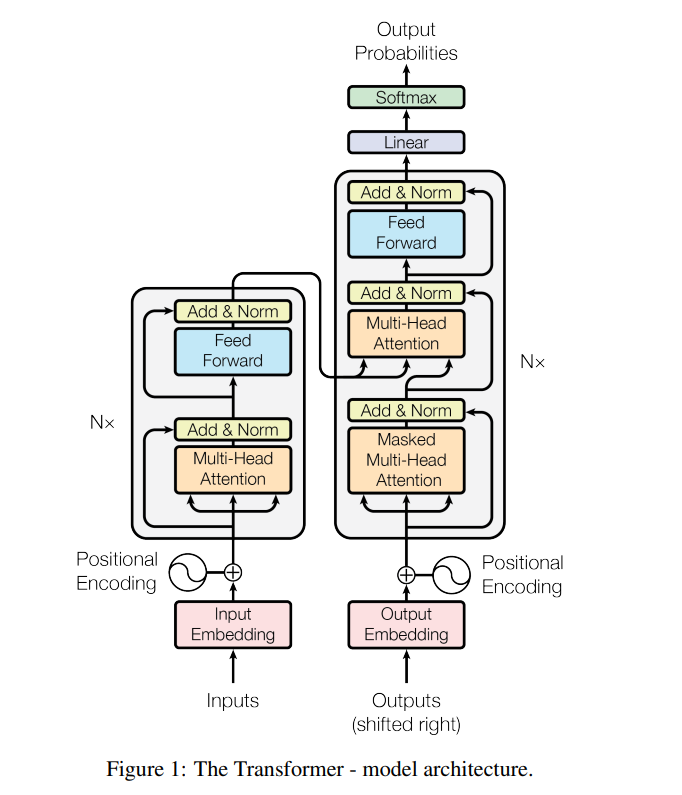
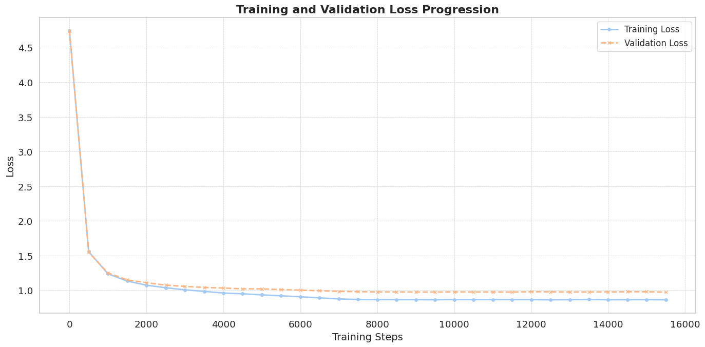

# Crafting the Attention!
This repository contains an implementation of a **decoder Transformer model** inspired by the original GPT architecture, designed to capture the **writing style and speech patterns** of characters from _Classroom of the Elite_ just for educational purposes. The model is trained to generate text that mimics the linguistic style of the light novel, producing new sentences in the same tone as the source material.
It still carries some fragmented, abstract tone , so it can be enhanced more and better .

### 📜 **Paper Implementation**

This repository is inspired by the "Attention Is All You Need" paper by Vaswani et al. (2017), which introduced the Transformer architecture , we closely follow its core principles while making a slight modification .Our model network consists of **10.82 million parameters**, optimized for text generation tasks. The loss function used is **Average Negative Log-Likelihood (ANLL)**, making it suitable for evaluating language modeling quality.



### 📂 **Dataset**

The dataset is composed of dialogues and narration from _Classroom of the Elite_ a well-known light novel series, leveraging a dataset containing 7,000 pages (5.5 million characters) from the novels, preprocessed into tokenized sequences suitable for training a GPT-based model. The model learns the **characters interactions** from the source text to generate **new** passages resembling the original writing.

### 🏗 **Model Architecture**

*   **Embedding Layer:** Token & positional embeddings.
    
*   **Transformer Blocks:**  Scaled Dot-Product Attention , Masked-Multi-head self-attention & feedforward layers.
    
*   **Layer Normalization:** Pre-LN setup for better gradient flow.

*   **Residual Connections:** (Skip connections) .
    
*   **Decoder architecture:** No cross-attention, as the model generates text autoregressively.

*   **Dropout** applied after each attention scores , after the projection of concatenated attention heads and applied after the second linear layer in the feedforward network.

*   **Usual learned linear transformation and softmax function** to convert the decoder output to predicted next-token probabilities.

  Following the OpenAI paper "Language Models are Unsupervised Multitask Learners" , Layer normalization was moved to the input of each sub-block, similar to a pre-activation residual network and an additional layer normalization was added after the final selfattention block .
    

### 🏋 **Training Details**

*   **GPU:** A100 
    
*   **Training Time:** ~35 minutes (~15,000 iterations)
    
*   **Validation Loss:** **0.9729 (Negative Log-Likelihood)**

    

### ✍ **Sample Generation**

The model generates text based on provided prompts , it contains some nonsensical outputs for now , but here are some examples:

#### **Generated Sample (Prompt: "justice")**

> _"Justice was leaving."_
> 
> _Students were dust as well. It wasn’t Karuizawa-san threatened: "Huh? I, that’s no way to spend time with us. I’m the one with him."_
> 
> _"Well, I think you need to disappear on what she says I like,” I pointed my pocket with a smile. However, Horikita gave a fight smile like they were an incredibly envisionating game."_
> 
> _"She growled agony."_
> 
>  "I don’t care about all by this time. I don’t even show any mounts,”

#### **Generated Sample 2** (Prompt : -empty-/torch.zeros((1, 1)))

> _She couldn’t just make a panic. I got on the rkness she didn’t, but looked around. Even though myself, I'd forgot about Karuizawa’s one friend—another couple for food—1t was pretty bictive perfect to blow up to Kei._
> 
> _I wondered if he hadn’t just told her attention. Her eyes did get involved. “Ryuuen and Hirata. You man., you sent him attention. Bet me injured your stress next more right now, so I show up after you get up with me.”_
> 
> _We’d also obediently take the third-years and line with overall Violence. If that happened, I wasn’t not exactly who, even subjected. As Ryuuen only walked, it was terrible we’d stand by such a year._


🚀 **Future work:** Refining output quality, improving dataset preprocessing, and potentially incorporating fine-tuning techniques for **better coherence and contextual awareness**.

## Setup and Execution :
Go to the desired architecture in the **src** :

1. Create a Virtual Environment::

```bash
python -m venv venv
venv\Scripts\activate
```

2. Install Requirements::

```bash
pip install -r requirements.txt
```

3. Execute/train/evaluate the Model::

```bash
python main.py # for training
python test.py # for executing with prompts
python evaluate.py # evaluation
```

